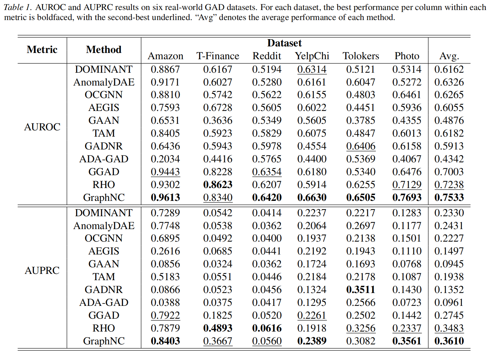

<div align="center">


  <h2><b> Normality Calibration in Semi-supervised Graph Anomaly Detection </b></h2>
</div>

<div align="center">
[](https://arxiv.org/abs/2510.02014)


</div>

---
## Overview
We propose **GraphNC**, a <u>graph</u> <u>n</u>ormality <u>c</u>alibration framework that leverages both labeled and unlabeled data to calibrate the normality from a teacher, namely a pre-trained semi-supervised GAD model, jointly in **anomaly score** and **representation** spaces. GraphNC includes two main components: anomaly <u>score</u> <u>d</u>istribution <u>a</u>lignment (**ScoreDA**) and perturbation-based <u>norm</u>ality <u>reg</u>ularization (**NormReg**). **ScoreDA** optimizes the anomaly scores of our model by aligning them with the score distribution yielded by the teacher. Since the teacher provides accurate scores for most normal nodes and a subset of anomaly nodes, this alignment effectively pulls the anomaly scores of the two classes toward opposite ends, resulting in more separable anomaly scores.
To mitigate the misleading effects of inaccurate teacher scores, **NormReg** is designed to regularize normality in the representation space. Specifically, it encourages more compact representations of normal nodes by minimizing a perturbation-guided consistency loss solely on labeled nodes.


<div align="center"></div>


## Main Results

<div align="center"></div>


The code and model will be uploaded soon ! 


## 📖 Citation
    
If you find this work useful, please cite our paper:

```bibtex
@article{zeng2025normality,
  title={Normality Calibration in Semi-supervised Graph Anomaly Detection},
  author={Zeng, Guolei and Qiao, Hezhe and Ai, Guoguo and Guo, Jinsong and Pang, Guansong},
  journal={arXiv preprint arXiv:2510.02014},
  year={2025}
}
