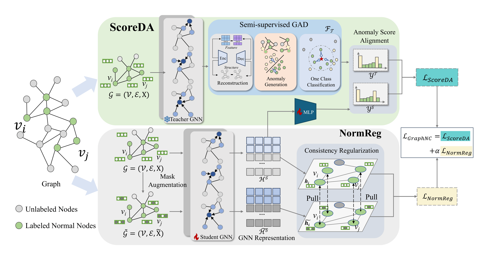

<div align="center">


  <h2><b> Normality Calibration in Semi-supervised Graph Anomaly Detection </b></h2>
</div>

<div align="center">

[](https://arxiv.org/abs/2510.02014)


</div>

---
## Overview
We propose **GraphNC**, a <u>graph</u> <u>n</u>ormality <u>c</u>alibration framework that leverages both labeled and unlabeled data to calibrate the normality from a teacher, namely a pre-trained semi-supervised GAD model, jointly in **anomaly score** and **representation** spaces. GraphNC includes two main components: anomaly <u>score</u> <u>d</u>istribution <u>a</u>lignment (**ScoreDA**) and perturbation-based <u>norm</u>ality <u>reg</u>ularization (**NormReg**). **ScoreDA** optimizes the anomaly scores of our model by aligning them with the score distribution yielded by the teacher. Since the teacher provides accurate scores for most normal nodes and a subset of anomaly nodes, this alignment effectively pulls the anomaly scores of the two classes toward opposite ends, resulting in more separable anomaly scores.
To mitigate the misleading effects of inaccurate teacher scores, **NormReg** is designed to regularize normality in the representation space. Specifically, it encourages more compact representations of normal nodes by minimizing a perturbation-guided consistency loss solely on labeled nodes.


<div align="center"></div>

## Environment Settings

This implementation is based on Python 3. The main dependencies are:

- torch==1.13.0
- torch-geometric==2.1.0
- torch-scatter==2.1.0+pt113cu117
- torch-sparse==0.6.15+pt113cu117
- dgl==0.5.3
- numpy==1.21.6
- scipy==1.7.3
- scikit-learn==1.0.2
- networkx==2.6.3
- seaborn==0.12.2
- tqdm==4.65.0

Example installation:

```bash
conda create -n graphnc python=3.7 -y
conda activate graphnc

pip install torch==1.13.0 --extra-index-url https://download.pytorch.org/whl/cu117
pip install torch-geometric==2.1.0
pip install torch-scatter==2.1.0+pt113cu117 torch-sparse==0.6.15+pt113cu117 \
  -f https://data.pyg.org/whl/torch-1.13.0+cu117.html
pip install dgl==0.5.3
pip install numpy==1.21.6 scipy==1.7.3 pandas==1.3.5 scikit-learn==1.0.2 \
  networkx==2.6.3 matplotlib==3.5.3 seaborn==0.12.2 tqdm==4.65.0
```

Alternatively, install from the provided package list:

```bash
pip install -r requirements.txt
```

## Datasets

For convenience, some datasets can be obtained from [google drive link](https://drive.google.com/drive/folders/1rEKW5JLdB1VGwyJefAD8ppXYDAXc5FFj?usp=sharing.). 
We sincerely thank the researchers for providing these datasets.

Put the `.mat` datasets under:

```text
dataset/
```

Example:

```text
dataset/photo.mat
dataset/tolokers.mat
```

## Pretrained Teacher Models

This repository includes pretrained GGAD teacher checkpoints:

```text
pretrained_model/Photo_GGAD_PreTrainModel.pth
pretrained_model/Tolokers_GGAD_PreTrainModel.pth
```

Use the corresponding checkpoint path with `--teacher_path`.

## Run Experiments

Example for Photo:

```bash
python main.py --dataset photo --teacher_path pretrained_model/Photo_GGAD_PreTrainModel.pth
```

Example for Tolokers:

```bash
python main.py --dataset tolokers --teacher_path pretrained_model/Tolokers_GGAD_PreTrainModel.pth
```

Training logs are saved to:

```text
ggad_labeledNormal/{dataset}.txt
```

## Project Structure

```text
GraphNC/
|-- main.py                  # training and evaluation entry point
|-- model.py                 # GGAD teacher and OCGNN student models
|-- utils.py                 # dataset loading and preprocessing utilities
|-- requirements.txt         # Python dependencies
|-- pretrained_model/        # pretrained teacher checkpoints
|-- GraphNC logo.png
`-- framework.png
```


## 📖 Citation
    
If you find this work useful, please cite our paper:

```bibtex
@article{zeng2025normality,
  title={Normality Calibration in Semi-supervised Graph Anomaly Detection},
  author={Zeng, Guolei and Qiao, Hezhe and Ai, Guoguo and Guo, Jinsong and Pang, Guansong},
  journal={arXiv preprint arXiv:2510.02014},
  year={2025}
}
```
